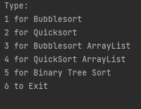
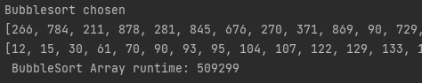
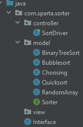
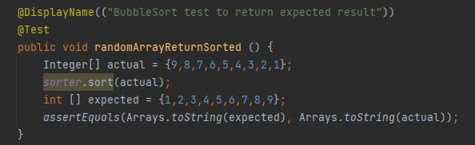

# Sorting Manager Project

## Table of Content
1. [About the Project](#About-the-Project)
2. [Getting Started](#Getting-Started)
3. [User Interface](#User-Interface)
4. [Design Patterns](#Design-Patterns)
5. [Testing](#Testing)
6. [Logging](#Logging)

### About the Project 
This is an individual project that was design by Sparta Global in the 4th week of training where we had to create a Sorting application
which consists of 3 different types. These include BubbleSort, QuickSort and Binary Tree Sort.

The different aspects of the project to be included is to be able to implement the different object oriented principles that we have been learing
about. This can help me as a programmer be able to improve and make my code easier to read and for other to be able to follow. 

Features that the applications has is having a console where the user is able to input numbers to be able to do different functions that the 
application has been designed to do. All the sorting algorithms are timed to show how fast they are executing with the same size array/arraylist.

### Getting Started
This will help you start my project on your computer.

1. Clone the repository using Git Bash - using git clone with the URL below

    ```https://github.com/MagerXser/Sorter.git```
2. Open the file where it is saved on the computer.


### User Interface 
There is a user interface where the user is able to type the number into the console to be able to navigate through the different
functions that the applications has. 

**Main menu:**

*This is the menu that will come out when you start the application as the console:



Each of the options is able to take you through each of the different Array or ArrayList types that are generic. The Arrays and the ArrayLists
are all randomised so that automatic creation of Arrays and ArrayList can be formed instead of using the same ones.

```Java
public interface Sorter<T> {
T[] sort(T[] array);
List<T> sort(List<T> arrayList);
}
```



### Design Patterns

**Model-View-Controller**

This is the design pattern that I have used for my project to show how the classes in my project interact with each other.



### Testing 

Not a lot went into testing as most of my time was on refactoring my code. I have implemented a JUnit test to test if my code works 
to create the correct array after it has been put through the methods that I have written. 



### Logging
I have also included just a simple logging to give information that the program has started but this will be also updated to have other logging
things inside it.

```[INFO] 2021-12-05 23:34:08,027 main My Sparta App - The application has started```